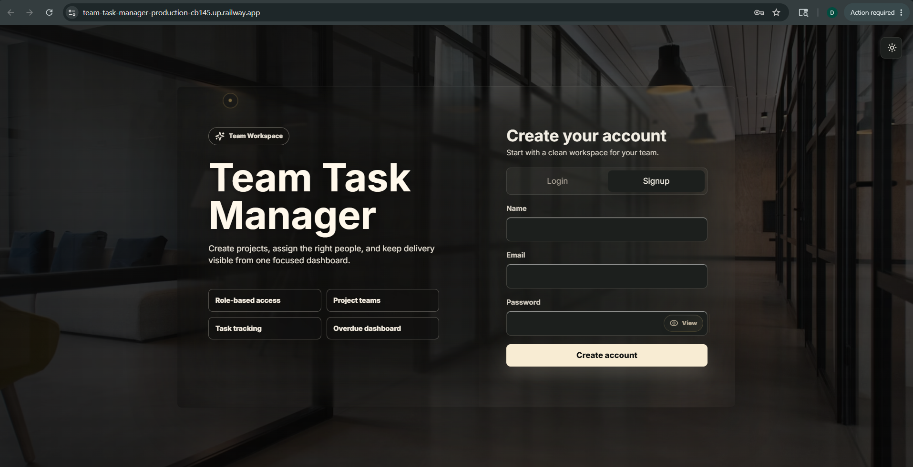
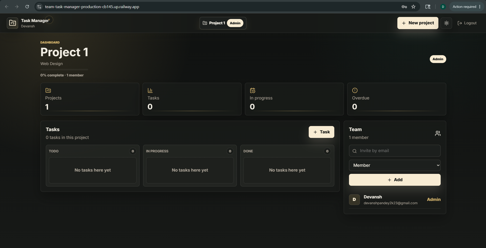
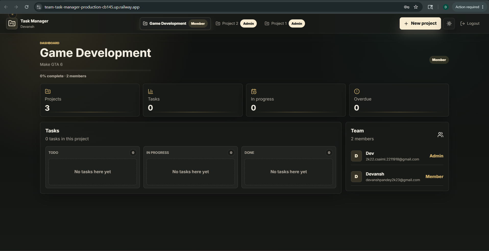
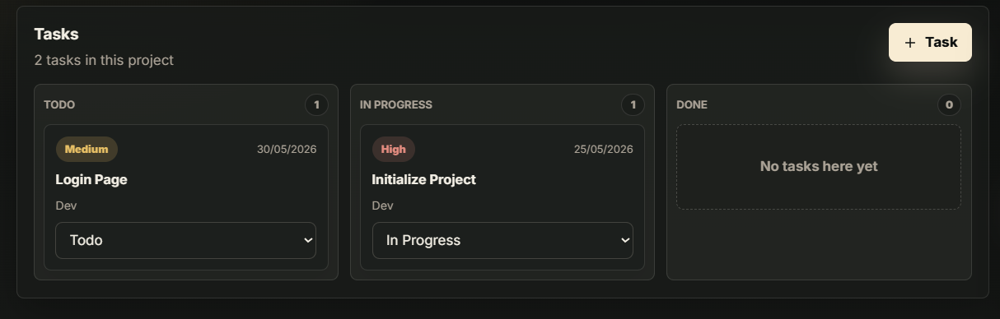
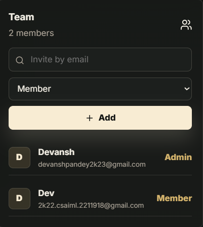

# Team Task Manager

A full-stack MERN web application for creating projects, managing teams, assigning tasks, and tracking progress with secure role-based access control.

Built using the MERN stack with JWT authentication, MongoDB Atlas, and deployed on Railway.

---

# Live Demo

- Live URL: https://team-task-manager-production-cb145.up.railway.app/
- GitHub Repository: https://github.com/Devansh-at-work/Team-Task-Manager

---

# Features

## Authentication & Authorization
- User Signup & Login
- JWT-based Authentication
- Password Hashing using bcrypt
- Protected API Routes
- Role-Based Access Control (Admin / Member)

---

## Project Management
- Create Projects
- Add Team Members
- Project-based Role Assignment
- Admin-only Project Controls
- View All Assigned Projects

---

## Task Management
- Create Tasks
- Assign Tasks to Team Members
- Task Priority Levels
- Task Status Tracking
- Due Dates & Overdue Detection
- Edit & Delete Tasks

---

## Dashboard
- Total Tasks Overview
- Completed Tasks
- Pending Tasks
- Overdue Tasks
- Progress Tracking
- Upcoming Deadlines

---

# Assignment Requirements Covered

- Authentication (Signup/Login)
- Project & Team Management
- Task Creation & Assignment
- Task Status Tracking
- Dashboard Analytics
- REST APIs
- MongoDB Database Integration
- Proper Validations & Relationships
- Role-Based Access Control
- Railway Deployment

Humanity loves assigning tasks to other humans and then building dashboards to visualize the anxiety. This app simply industrializes the process.

---

# Tech Stack

## Frontend
- React.js
- Vite
- React Router DOM
- Axios

## Backend
- Node.js
- Express.js

## Database
- MongoDB Atlas
- Mongoose

## Authentication
- JWT (JSON Web Token)
- bcryptjs

## Deployment
- Railway

<<<<<<< HEAD
## Containerization
- Docker
- Docker Compose
- Nginx

=======
>>>>>>> bd76190e1082aae4b45214833b5b54e888d28387
---

# Project Structure

```txt
Team-Task-Manager/
│
<<<<<<< HEAD
├── .dockerignore
├── docker-compose.yml
=======
>>>>>>> bd76190e1082aae4b45214833b5b54e888d28387
├── client/
│   ├── src/
│   │   ├── components/
│   │   ├── pages/
│   │   ├── services/
│   │   ├── context/
│   │   └── App.jsx
│   │
│   ├── public/
<<<<<<< HEAD
│   ├── .dockerignore
│   ├── Dockerfile
│   ├── nginx.conf
=======
>>>>>>> bd76190e1082aae4b45214833b5b54e888d28387
│   └── package.json
│
├── server/
│   ├── src/
│   │   ├── config/
│   │   ├── controllers/
│   │   ├── middleware/
│   │   ├── models/
│   │   ├── routes/
│   │   └── index.js
│   │
<<<<<<< HEAD
│   ├── .dockerignore
│   ├── .env
│   ├── Dockerfile
=======
│   ├── .env
>>>>>>> bd76190e1082aae4b45214833b5b54e888d28387
│   └── package.json
│
├── screenshots/
│
└── README.md
```

---

# Screenshots

## Login Page



---

## Dashboard



---

## Project Management



---

## Task Management



---

## Team Management



---

# Database Models

## User Model

```js
{
  name: String,
  email: String,
  password: String,
  role: ["admin", "member"]
}
```

---

## Project Model

```js
{
  title: String,
  description: String,
  createdBy: ObjectId,
  members: [ObjectId]
}
```

---

## Task Model

```js
{
  title: String,
  description: String,
  project: ObjectId,
  assignedTo: ObjectId,
  priority: ["low", "medium", "high"],
  status: ["todo", "in-progress", "completed"],
  dueDate: Date
}
```

---

# API Endpoints

## Authentication

### Register User

```http
POST /api/auth/signup
```

### Login User

```http
POST /api/auth/login
```

### Get Current User

```http
GET /api/auth/me
```

---

## Projects

### Get All Projects

```http
GET /api/projects
```

### Create Project

```http
POST /api/projects
```

### Get Project Details

```http
GET /api/projects/:id
```

### Add Member

```http
POST /api/projects/:id/members
```

---

## Tasks

### Get Tasks

```http
GET /api/tasks
```

### Create Task

```http
POST /api/tasks/project/:projectId
```

### Update Task

```http
PATCH /api/tasks/:id
```

---

# Local Development Setup

## Clone Repository

```bash
git clone https://github.com/Devansh-at-work/Team-Task-Manager.git
```

```bash
cd Team-Task-Manager
```

---

# Install Dependencies

```bash
npm run install:all
```

---

# Environment Variables

Create:

```txt
server/.env
```

Add:

```env
PORT=5000

MONGODB_URI=your_mongodb_connection_string

JWT_SECRET=your_secret_key

JWT_EXPIRES_IN=7d

CLIENT_ORIGIN=http://localhost:5173
```

---

# Run Development Server

```bash
npm run dev
```

Frontend:
```txt
http://localhost:5173
```

Backend:
```txt
http://localhost:5000
```

---

<<<<<<< HEAD
# Docker Setup

You can easily run the entire application (frontend, backend, and Nginx reverse proxy) locally using Docker Compose.

## 1. Environment Variables

Create a `.env` file in the **root** of the project:

```txt
.env
```

Add your MongoDB URI and a JWT Secret:

```env
MONGODB_URI=your_mongodb_connection_string
JWT_SECRET=your_secret_key
```

## 2. Run with Docker Compose

Build and start the containers:

```bash
docker-compose up --build
```

Access the application:
- **Frontend**: `http://localhost` (Served via Nginx)
- **Backend API**: `http://localhost:5000`

---

=======
>>>>>>> bd76190e1082aae4b45214833b5b54e888d28387
# Railway Deployment

## Deployment Steps

1. Push the repository to GitHub
2. Create a Railway project
3. Connect GitHub repository
4. Add environment variables
5. Deploy application

---

## Required Railway Variables

```env
MONGODB_URI=
JWT_SECRET=
JWT_EXPIRES_IN=7d
NODE_ENV=production
```

---

# Admin Access

There is no separate admin login.

- Any authenticated user can create a project
- The creator automatically becomes the Project Admin
- Existing Admins can promote/add members to projects

Because centralized power structures inevitably emerge even inside task manager apps.

---

# Security Features

- JWT Authentication
- Password Hashing using bcrypt
- Protected Routes
- Role-Based Authorization
- Environment Variable Protection
- Secure MongoDB Atlas Connection

---

# Learning Outcomes

This project demonstrates:

- Full-Stack MERN Development
- REST API Design
- MongoDB Relationships
- Authentication & Authorization
- Role-Based Access Control
- Railway Deployment
- Frontend & Backend Integration
- Secure API Development
- State Management

---

# Contributor

## Devansh Pandey

GitHub: https://github.com/Devansh-at-work

---

# License

Licensed under the MIT.