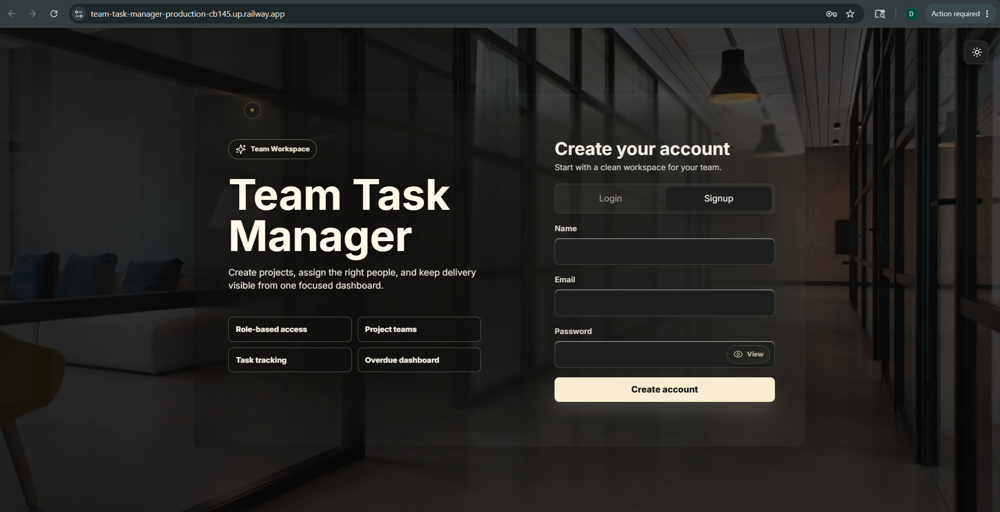
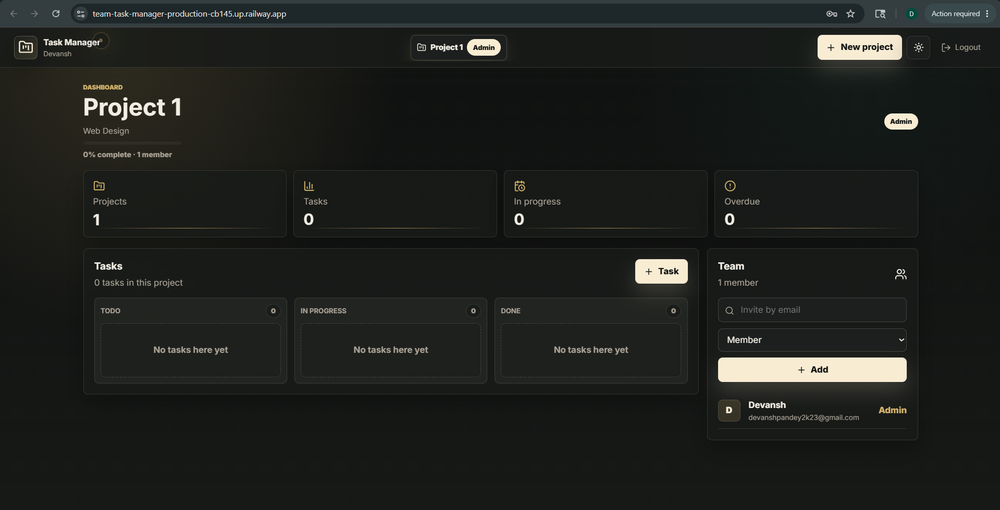
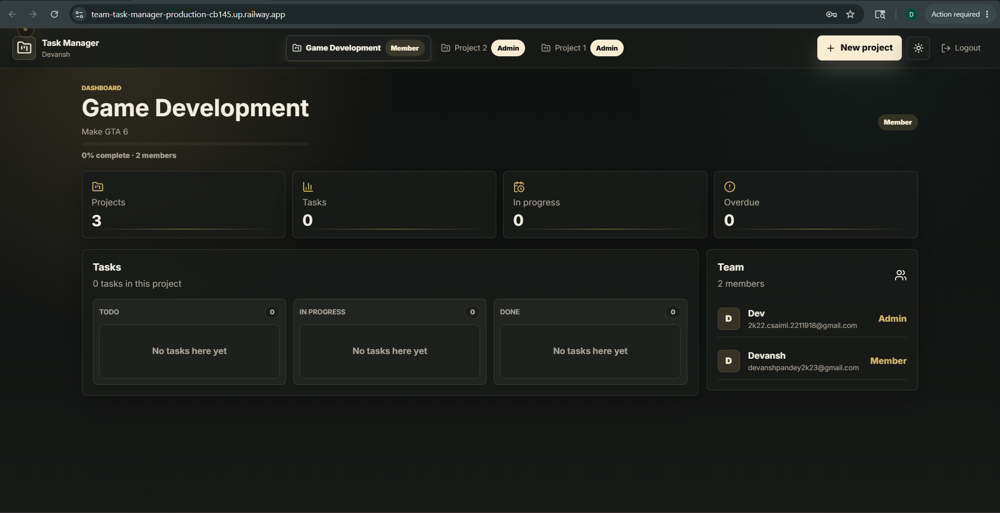
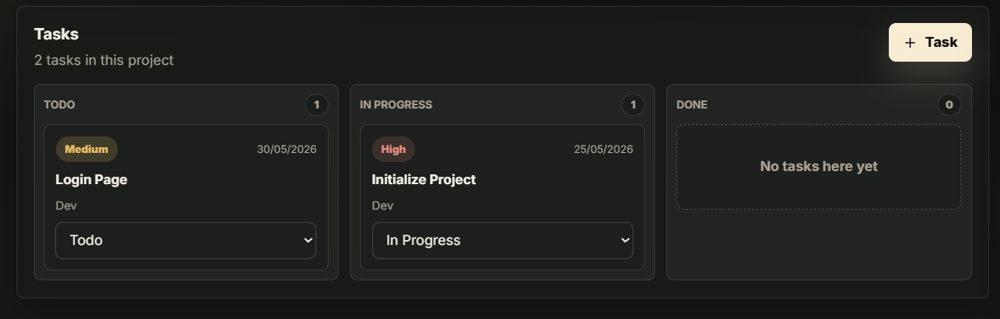
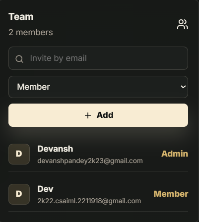

# Team Task Manager

A premium, full-stack MERN application for managing projects, team memberships, budgets, tasks, and sub-tasks with a gorgeous glassmorphic UI, viewport portals, and role-based permissions.

---

# Live Demo & Repositories

- **Live URL**: [https://team-task-manager-production-cb145.up.railway.app/](https://team-task-manager-production-cb145.up.railway.app/)
- **GitHub Repository**: [https://github.com/Devansh-at-work/Team-Task-Manager](https://github.com/Devansh-at-work/Team-Task-Manager)

---

# Key Features

### 📊 Project & Expense Tracker
- **Rupee-based Ledger (₹)**: Track task-level expenditures with date, note, and author logging.
- **Budget Control**: Admins can set project budgets; active stats show remaining vs. overrun limits.
- **Budget Overrun Indicators**: Color-coded meters warning users when expenditures approach or exceed budget thresholds.

### 🛡️ Role-Based Access & Safety Control
- **Creators as Admins**: Creators automatically become Project Admins with privileges to manage team roles and project settings.
- **Member Task Privileges**: Project members can create tasks and assign/reassign members to tasks and sub-tasks.
- **Safety Deletion**: Projects can **only** be deleted by Admins once they are marked as `"Completed"` to avoid accidental data loss.

### 📥 Import Tasks from Excel
- **Sheet Parser**: Upload `.xlsx`, `.xls`, or `.csv` sheets directly in the browser using client-side parsing (SheetJS).
- **Auto Field Mapping**:
  - `Item No.` / `Item Number` → Sequence No.
  - `Part Number` → Sub-task Name
  - `Description` → Description
  - `QTY.` / `Quantity` → Quantity
- **Interactive Mapping Portal**: Specify a Parent Task Name, and inline-assign statuses, actions (`Fabrication` / `Purchase`), assignees, and due dates for each sub-task row before final creation.
- **Post-Creation Edits**: Sub-tasks remain fully editable by project members and admins.

### 🎨 Premium Glassmorphic UI
- **Translucent Glass Panels**: Cards, metrics, panels, and modals feature a high-fidelity translucent overlay (`--surface` opacity of `0.52` - `0.55` and `14px` backdrop blur).
- **Cascading Dropdowns**: Dropdown items render as distinct, staggered oval glass pills.
- **Viewport Portals**: Dropdowns mount to `document.body` via React Portals, preventing table overflow clipping.
- **Smart Alignment**: Menus automatically detect bottom viewport boundaries and flip upwards when close to the taskbar.
- **Zero-Lag Ambient Glow**: An ambient cursor aura follows pointer movements with zero lag.

---

# Tech Stack

- **Frontend**: React.js, Vite, SheetJS (`xlsx`), Lucide React icons, Vanilla CSS.
- **Backend**: Node.js, Express.js, MongoDB Atlas (Mongoose ODM).
- **Authentication**: JSON Web Tokens (JWT), bcryptjs hashing.
- **Validation**: Zod schema validation.

## Containerization
- Docker
- Docker Compose
- Nginx

---

# Project Structure

```txt
Team-Task-Manager/
│
├── .dockerignore
├── docker-compose.yml
├── client/
│   ├── src/
│   │   ├── components/
│   │   ├── pages/
│   │   ├── services/
│   │   ├── context/
│   │   └── App.jsx
│   │
│   ├── public/
│   ├── .dockerignore
│   ├── Dockerfile
│   ├── nginx.conf
│   └── package.json
│
├── server/
│   ├── src/
│   │   ├── config/
│   │   ├── controllers/
│   │   ├── middleware/
│   │   ├── models/
│   │   ├── routes/
│   │   └── index.js
│   │
│   ├── .dockerignore
│   ├── .env
│   ├── Dockerfile
│   └── package.json
│
├── screenshots/
│
└── README.md
```

---

# Screenshots

## Login Page



---

## Dashboard



---

## Project Management



---

## Task Management



---

## Team Management



---

# Database Models

## User Model

```js
{
  name: String,
  email: String,
  password: String,
  role: ["admin", "member"]
}
```

---

## Project Model

```js
{
  title: String,
  description: String,
  createdBy: ObjectId,
  members: [ObjectId]
}
```

---

## Task Model

### Task Model
```js
{
  title: String,
  description: String,
  project: ObjectId,
  assignedTo: [ObjectId],
  createdBy: ObjectId,
  status: ["Todo", "In Progress", "Done"],
  priority: ["Low", "Medium", "High"],
  dueDate: Date,
  estimatedCost: Number,
  actualCost: Number,
  expenses: [
    {
      amount: Number,
      note: String,
      addedBy: ObjectId,
      date: Date
    }
  ],
  subTasks: [
    {
      sequenceNo: String,
      name: String,
      description: String,
      quantity: Number,
      status: ["Order Placed", "Material in Transit", "Order Received", "Order Accepted", "Order Rejected", "Order Returned"],
      action: ["Fabrication", "Purchase"],
      assignedTo: ObjectId,
      dueDate: Date
    }
  ]
}
```

---

# API Endpoints

### 🔐 Authentication
- `POST /api/auth/signup` - Register user
- `POST /api/auth/login` - Authenticate & obtain JWT
- `GET /api/auth/me` - Get profile details

### 📁 Projects
- `GET /api/projects` - List all projects
- `POST /api/projects` - Create a project
- `GET /api/projects/:id` - Fetch project dashboard stats and tasks list
- `PATCH /api/projects/:id/budget` - Update budget (Admin only)
- `PATCH /api/projects/:id/members/:userId` - Update user project role (Admin only)
- `POST /api/projects/:id/members` - Invite member to project (Admin only)
- `DELETE /api/projects/:id` - Delete project (Admin only; blocked unless project status is `"Completed"`)

### 📝 Tasks & Expenses
- `GET /api/tasks` - List user tasks across projects
- `POST /api/tasks/project/:projectId` - Create task/sub-tasks (all members)
- `PATCH /api/tasks/:id` - Update task status, costs, assignees, or sub-tasks list
- `DELETE /api/tasks/:id` - Delete task (Admin only)
- `POST /api/tasks/:id/expenses` - Log expense item

---

# Local Development Setup

### 1. Clone & Set Up Directory
```bash
git clone https://github.com/Devansh-at-work/Team-Task-Manager.git
cd Team-Task-Manager
```

### 2. Install Dependencies
```bash
npm run install:all
```

### 3. Configure Environment Variables
Create a file at `server/.env` and add:
```env
PORT=5000
MONGODB_URI=your_mongodb_connection_string
JWT_SECRET=your_jwt_secret_token
JWT_EXPIRES_IN=7d
CLIENT_ORIGIN=http://localhost:5173
```

### 4. Run Development Server
```bash
npm run dev
```

Frontend:
```txt
http://localhost:5173
```

Backend:
```txt
http://localhost:5000
```

---

# Docker Setup

You can easily run the entire application (frontend, backend, and Nginx reverse proxy) locally using Docker Compose.

## 1. Environment Variables

Create a `.env` file in the **root** of the project:

```txt
.env
```

Add your MongoDB URI and a JWT Secret:

```env
MONGODB_URI=your_mongodb_connection_string
JWT_SECRET=your_secret_key
```

## 2. Run with Docker Compose

Build and start the containers:

```bash
docker-compose up --build
```

Access the application:
- **Frontend**: `http://localhost` (Served via Nginx)
- **Backend API**: `http://localhost:5000`

---

# Railway Deployment

## Deployment Steps

1. Push the repository to GitHub
2. Create a Railway project
3. Connect GitHub repository
4. Add environment variables
5. Deploy application

---

## Required Railway Variables

```env
MONGODB_URI=
JWT_SECRET=
JWT_EXPIRES_IN=7d
NODE_ENV=production
```

---

# Admin Access

There is no separate admin login.

- Any authenticated user can create a project
- The creator automatically becomes the Project Admin
- Existing Admins can promote/add members to projects

Because centralized power structures inevitably emerge even inside task manager apps.

---

# Security Features

- JWT Authentication
- Password Hashing using bcrypt
- Protected Routes
- Role-Based Authorization
- Environment Variable Protection
- Secure MongoDB Atlas Connection

---

# Learning Outcomes

This project demonstrates:

- Full-Stack MERN Development
- REST API Design
- MongoDB Relationships
- Authentication & Authorization
- Role-Based Access Control
- Railway Deployment
- Frontend & Backend Integration
- Secure API Development
- State Management

---

# Contributor

## Devansh Pandey

GitHub: https://github.com/Devansh-at-work

---

# License

Distributed under the MIT License.